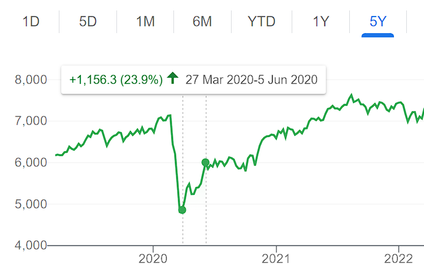

# Investing, Risk, and How to Paper Trade Properly

> Paper trading is when you chicken out on putting *real* money behind your predictions
> of stock movements, and is a total cop out. Don't do it. Trade with real money
> instead!
>
> Source: *trading platforms that make a brokerage on every real trade you make*
> *and aren't liable if you lose money.* Go figure.

Details are important. I am not a financial advisor, but I do invest. This is
not financial advice.

## How I lost $700 doing terrible paper trading

My first foray into the stock market was in April of 2020, right after the COVID
pandemic was first announced. The stock market had tanked 30% in the preceding
month, but growth had returned, and I had a couple grand that was doing nothing
in the bank, since going outside wasn't really an option.

I'm a cautious fellow, but had no clue what I was doing; so I decided that
I would take the top 10 stocks from a heavily advertised stock recommendation
platform (not naming names here, but something involving a jester). I decided to
presume I bought the appropriate amount of shares in A2 milk, Aristocrat Leisure
and a bunch of other mid cap Australian stocks, and follow them on paper over the
next month.

For the entire month, the stocks *just kept going up and up*. My $10k of paper money
snowballed into $11k; projecting that to over the entire year, I would double my
money if I put my money into *those stocks*, right now.

So in May, I did. And then over the next 15 days, my basket of stocks dropped by
$700, and I panicked, told my family; they panicked, we sold the stocks, and I
lost $700, just like that.

What went wrong?

## Lesson 1: The index is the benchmark, and your stock picks are risk/opportunity

If we have a look at the period of time in which I was paper trading, the chart
for the Australian S&P 200 (largest 200 companies on the Australian stock market)
looked liked this:

If all S&P 200 companies were going up, because there had been a 30% dip in the
stock market a month prior even though there weren't any substantial changes in the
long term viability of most businesses-big-enough-to-be-publically-listed after COVID,
*of course my mid cap stocks were going to go up*. Looking at the chart here, the
S&P 200 would have taken my $10,000 investment to $12,000, which is even better
than my $11,000 that I had at the start.

Buying into the index is called passive investing. Sure, it's a chore to find money
to save and then girt your teeth and press that 'buy' button, but it's passive
compared to the active investing that hedge fund managers do on a *full-time basis*
where they scour information sources to find stocks that are cheaper than they
ought to be, and buy them.

There are two types of risk when you buy a stock: *market risk/performance*, and
*individual stock risk/performance*. Market risk/performance is when the entire stock market moves up, or crashes because of large scale economic factors; and every company will take a hit in these kinds of events. Picking individual stocks adds extra risk/performance *on top of* the market risk. When your stock picks' variance is positive, you're a genius, and in retrospect we call it performance. When it falls, you're an idiot, and in retrospect we call it a risk. Sudden, unforeseen risk compared to index risk is much more frequent than sudden, unforeseen performance, because ... shit happens.

Your backtesting should match your strategy, but also be benchmarked against a proper
baseline strategy, which should be putting all your funds in the market index.

> If you're here for passive investing and you're Australian, check out this blog:
> <https://passiveinvestingaustralia.com/fear-of-investing/>. It is hands
> down the best Australian passive investing blog and I love it heaps.

## Lesson 2: Be clear on what your *trading* strategy is. (Start by actually having a strategy!)

When I did my backtesting, my strategy was:

1. Pick the stocks that trading recommendation site told me.
2. Watch stocks move around.
3. ???
4. Profit.

Sure I planned my paper trading, but that was it: I planned a *paper trading strategy*,
not a *real trading strategy*. I didn't consider many important questions like: When
would I put more money in? When would I cash out and take my profits? At what point
would I cut my losses if I did lose money? (And to be fair enough on my younger self,
those are hard questions to answer).

Really those answers are the easy answers, and not really a differentiating part
of a trading strategy, so I can answer them here for you.

### When do you put more money in?

Any time you have spare money that you don't plan on spending within the next 'strategy cycle'.

What is a strategy cycle?

A strategy cycle is the amount of time between when you put money in vs when you're planning to withdraw money, or when you're planning to reconsider the degenerate gambling activity you're calling investing. If you're day trading, that's one day. If you're long term investing, that could be 'now until I can afford to buy a house'. If you're planning to withdraw money *when you make a profit*, then your strategy cycle ends when you die, because you might not ever make a net profit. Pick a withdraw/reconsider interval that you can commit to!

### When do you cash out your profits? / When do you cut your losses if you do lose money?

You cash out when the opportunity you predicted has eventuated. You cut losses when the risk you mis-recognised as an opportunity has eventuated; or, a better opportunity has come up.

Your trading should be based on information which comes together to form a dynamic model of the world. Unless you're investing passively, your investment moves should be based on price movements you forsee might happen, also known as opportunities. Part of your dynamic model of the world *must* include the fact that there are hundreds of fund managers working full time to also identify these opportunities - and when they do, they'll swing for those opportunities.

And that's perfectly fine. When a fund manager swings for an opportunity *after you*, then they will be buying the stock for more than you paid for it, because you (and the others who have spotted the opportunity) won't be as willing to let go of the stock. You will demand a higher price for it; and if the fund manager is willing to pay for it, then you walk away with a profit.

 

Remember: if your stock is literally doing nothing, 'a better opportunity' *always exists*: stop investing in that single stock and move it into a stock index, since the stock index is free of individual risk.

A more complex answer takes into account the probability of making wins / losses. In fact, there's a mathematical formula for deciding the-proportion-of-your-wealth-to-put-into-any particular-stock-opportunity, called the [Kelly Criterion](https://en.m.wikipedia.org/wiki/Kelly_criterion). If your current proportion doesn't match the kelly criterion proportion, buy or sell your stock until it does.

## Lesson 3: Paper trade / backtest for many multiples of your strategy cycle

When I paper traded for one month in April 2020, I was exposed to one month of market conditions: some of the best market conditions in the last decade. Notwithstanding the fact that I didn't have a particular strategy cycle in mind, this was definitely an incredibly short amount of time. If you don't paper trade for multiples of your strategy cycle, then you won't know the hundreds of ways a strategy can go south; or even if your strategy is any good.

Naturally you might not want to wait for years of market conditions before you finally decide to invest in the stock market at the ripe old age of 89. Fortunately, the market has existed long before you were born, and you can find historical data to backtest your strategies on.

### Paper trade / backtest the real version of your strategy, not the best version of your strategy

If there is one point we can take away from the trading platforms that advise you
to not paper trade, it is that paper trading allows you to take the best version of your strategy, *especially if you do it manually, in real time*. If you're paper trading, you might say 'Oh, I'll break from my strategy because I really think my stock is going to go up', or 'Oh, I'll pretend I had 10% more in that stock at the start and made a better bet, it's just a paper test!'

Don't do that. Be realistic about your strategy. Even better, automate it, and run it against a few years of data if possible.

### Be careful of available information in your backtest

When designing your backtest, make sure you only provide your strategy implementation with information available at some time in the past. (Writing a strategy implementation that can predict the future is pretty funny though, you usually end up with becoming a multi-millionaire by foreseeing the future. Oops!)

There's a very fine line between reasonable assumptions and historically bound assumptions. For instance, putting a strategy clause that says 'I will sell my stocks before the GFC in 2008' might seem obviously pandering to historical assumptions, but what about 'I will sell my stocks if they have fallen for more than 7 days in a row'. That may sound reasonable, until you realise that stocks falling for 7 days in a row might have been inconceivable prior to the first few times it happened during a major economic downturn.

Yeah folks that's it. Have fun paper trading! We will discuss sources of trading opportunity in the near future, stay tuned :)
